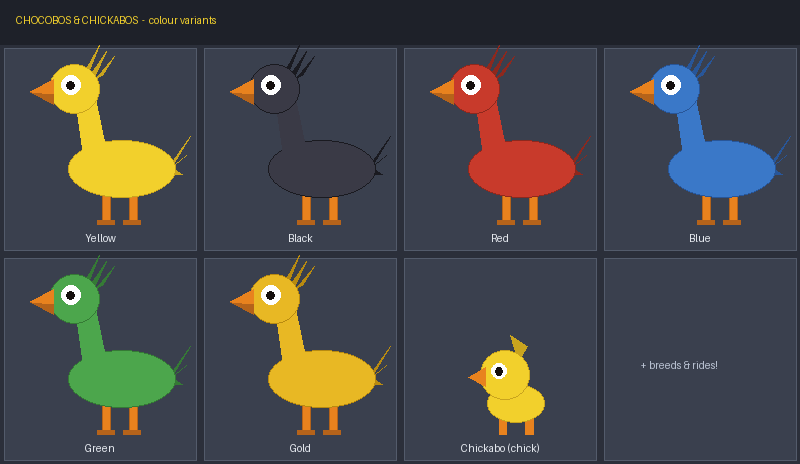

# Chocobos & Chickabos — a Minecraft Bedrock Add-On

Adds **Chocobos** (the big rideable birds from *Final Fantasy*) and their baby
**Chickabos** to Minecraft Bedrock Edition as real, fully-featured creatures —
they spawn in the wild, can be tamed, saddled and ridden, and bred to hatch
chicks, in **six classic colour variants**.



> The image above is a stylised illustration of the variants. In-game the
> creatures use a blocky, Minecraft-style voxel model (see
> `Chocobos_RP/models/entity/`).

---

## Features

- 🐤 **Chocobo** — a tall rideable bird mob with idle/walk/look animations.
- 🐥 **Chickabo** — the baby form (its own cuter, rounder model). Grows into an adult.
- 🎨 **6 colour variants**, each with its own stats and abilities (table below).
- 🥬 **Gysahl Green** — a custom food item used to tame, breed and lure Chocobos
  (craftable, droppable, edible).
- 🐎 **Taming, saddling & riding** with controllable movement and power-jump.
- ❤️ **Breeding** two tamed adults produces a Chickabo chick.
- 🌍 **Wild spawning** in grassy/forested biomes, in small herds.
- 🔊 Sound, loot (feathers), spawn egg, and a creative-menu item.

### Colour variants

| Variant | Rarity     | Speed | Jump   | Special ability                     |
|---------|------------|-------|--------|-------------------------------------|
| Yellow  | Common     | ★★☆☆☆ | ★★☆☆☆  | The classic all-rounder             |
| Green   | Uncommon   | ★★★☆☆ | ★★★★☆  | Great jumper (hills & mountains)    |
| Blue    | Uncommon   | ★★★☆☆ | ★★☆☆☆  | Swims / crosses water without fear  |
| Red     | Uncommon   | ★★★☆☆ | ★★★☆☆  | **Fireproof** (immune to fire/lava) |
| Black   | Rare       | ★★★★☆ | ★★★★★  | Fast with a huge jump               |
| Gold    | Very rare  | ★★★★★ | ★★★★★  | Fastest, fireproof **and** swims    |

---

## Requirements

- Minecraft **Bedrock Edition 1.20+** (Windows 10/11, mobile, console, or Realms).
- Works in survival or creative. No experimental toggles required.

---

## Installation

### Easiest — one-tap import (`.mcaddon`)

1. Build the packs (or grab them from a release):
   ```bash
   bash tools/build_mcaddon.sh
   ```
   This creates `dist/ChocobosAndChickabos.mcaddon`.
2. Open / double-tap that file on a device with Minecraft installed. It imports
   **both** packs automatically.
3. Create or edit a world → **Behavior Packs** → activate *Chocobos & Chickabos*.
   The matching resource pack is applied automatically (it's a dependency).

`dist/` also contains separate `ChocobosBP.mcpack` and `ChocobosRP.mcpack` if you
prefer to import them individually.

### Manual (copy folders)

Copy the two source folders into your Bedrock `com.mojang` directory:

| Pack            | Copy `Chocobos_BP` / `Chocobos_RP` into        |
|-----------------|------------------------------------------------|
| Behavior Pack   | `com.mojang/development_behavior_packs/`        |
| Resource Pack   | `com.mojang/development_resource_packs/`         |

Then enable both in your world settings (activate the behavior pack; accept the
resource-pack dependency).

---

## How to play

1. **Find one.** Chocobos roam plains, forests, savannas, jungles, taigas,
   birch forests and meadows in herds. In creative, use the **Chocobo Spawn Egg**
   or `/summon cb:chocobo`.
2. **Get Gysahl Greens.** Craft them (see recipe), or they occasionally drop
   from Chocobos.
   ```
    W       W = Wheat
   WCW      C = Carrot      →  2 × Gysahl Green
    W
   ```
3. **Tame.** Hold Gysahl Greens and feed a Chocobo (use the item on it) until
   hearts appear.
4. **Saddle.** With the Chocobo tamed, use a **Saddle** on it.
5. **Ride.** Mount it (empty hand / mount button). Steer like a horse; hold the
   jump button to **power-jump** (charge & release).
6. **Breed.** Feed two tamed adults Gysahl Greens to enter love mode — they'll
   produce a **Chickabo** chick.
7. **Grow up.** Chickabos mature into adults over time; feed them **wheat** to
   speed it up. Tame & saddle them once grown, just like their parents.

---

## Building from source

The models and textures are generated from a single source of truth so the UV
maps and skins can never drift apart.

```bash
pip install Pillow                 # one-time
python3 tools/generate_assets.py   # writes geometry + all variant textures + icons
python3 tools/make_preview.py      # (optional) regenerates docs/preview.png
bash    tools/build_mcaddon.sh      # zips dist/*.mcpack and *.mcaddon
```

---

## Project structure

```
Chocobos_BP/                 Behavior pack (server-side logic)
  manifest.json
  entities/chocobo.json      health, AI, taming, riding, breeding, variants
  items/gysahl_green.json    custom food item
  spawn_rules/chocobo.json   wild spawning
  loot_tables/…              drops
  recipes/…                  Gysahl Green crafting
  texts/…                    names
Chocobos_RP/                 Resource pack (client-side visuals)
  manifest.json
  entity/chocobo.json        ties model/texture/anims/render controllers
  models/entity/*.geo.json   Chocobo (adult) + Chickabo (baby) geometry
  textures/entity/chocobo/   6 adult + 6 baby variant skins
  textures/items/            Gysahl Green icon
  animations/…               idle / walk / look-at
  animation_controllers/…    idle⇄walk state machine
  render_controllers/…       picks model by age + skin by variant
  sounds.json, sounds/…      sound mapping
tools/                       generators + packager
docs/preview.png             variant preview image
```

## Customising

- **Variant stats / abilities** — `Chocobos_BP/entities/chocobo.json`
  (`cb:variant_*` component groups: `minecraft:movement`,
  `minecraft:horse.jump_strength`, `minecraft:fire_immune`, swim settings).
- **Spawn rarity** — the `randomize` weights in the `minecraft:entity_spawned`
  event; **where they spawn** — `Chocobos_BP/spawn_rules/chocobo.json`.
- **Colours / model shape** — edit the palettes or bone/cube tables in
  `tools/generate_assets.py`, then re-run it.

## Notes & limitations

- This is a **fan-made** project. *Final Fantasy*, *Chocobo* and related names
  are trademarks of **Square Enix**. Use it for personal/non-commercial play.
- Sounds reuse built-in vanilla audio (chicken calls + footsteps) so no custom
  audio ships with the pack.
- "Black" Chocobos are fast, high-jumpers rather than true fliers — proper
  flight is a possible future enhancement.
- A saddle is functional but not rendered on the model yet (no attachable).
